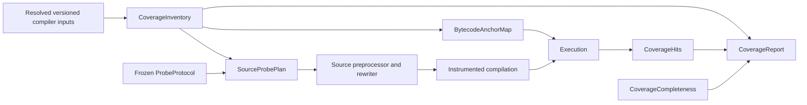

# Source Coverage Instrumentation Plan

## Goal

Make `forge coverage --instrument-source` truthful, syntax-preserving, and predictable across the
documented supported Solidity surface.

Source instrumentation cannot be byte-for-byte or gas-equivalent to an ordinary test run. The goal
is to preserve source-level behavior for contracts that do not observe instrumentation effects,
while identifying intrinsic differences and unsupported cases before presenting a complete coverage
report.

The implementation must never improve a reported percentage by silently removing statements,
branches, functions, or files from the coverage denominator.

## Implementation status

The first-release implementation is complete for Solidity `>=0.8.0` source inputs that do not use
inline assembly and do not depend on the intrinsic instrumentation differences described below. It
now includes resolved-input preprocessing, stable opaque probe identities, syntax-checked typed
rewrites, canonical item accounting, hit propagation through unit/table/fuzz/invariant execution,
and fail-closed completeness reporting with an explicit `--allow-partial` override.

The implementation deliberately reports legacy Solidity, Vyper, standalone Yul, inline assembly,
unmapped canonical items, and probe/helper collisions as partial or failed rather than silently
claiming complete source coverage. The exact capability boundary and validation evidence are tracked
in [`source-coverage-capabilities.md`](source-coverage-capabilities.md).

The remaining rollout work is operational release gating rather than an unimplemented collection
path: run the full compiler-version and optimization matrix, measure gas/code-size overhead against
the agreed thresholds, and complete the nightly soak before promoting source instrumentation beyond
its experimental status.

## Semantic compatibility contract

Source probes change generated bytecode. The support claim must therefore distinguish what the
backend preserves from what instrumentation inherently changes.

### Preserved target behavior

For supported contracts with sufficient gas, stack, and code-size headroom, and after filtering the
internal probe calls, source instrumentation must preserve:

- Test selection, dependency resolution, fuzz seed, and runtime project configuration.
- Storage changes and user-visible state transitions.
- Return data and revert data.
- User-emitted logs.
- User-code call ordering and control-flow outcomes.

Every category requires differential fixtures. A mismatch is a correctness failure, not an accepted
coverage approximation.

### Intrinsic instrumentation differences

The following necessarily change and must be documented:

- Gas consumption and `gasleft()` values.
- Initcode and runtime bytecode size and hash.
- Program counters, source maps for transformed code, stack pressure, and trace shape.
- Creation code returned by Solidity type introspection.
- CREATE2 addresses derived from instrumented initcode.

### Unsupported or degraded behavior

Tests or contracts that depend on the intrinsic differences above are outside the complete-support
surface unless a specific mitigation is implemented. This includes:

- Exact gas assertions or gas-threshold branching.
- Runtime/initcode size or hash assertions, including `EXTCODEHASH` and self-introspection.
- CREATE2 address assertions based on original initcode.
- Code-size-limit, stack-limit, or out-of-gas boundary tests.
- Assertions over unfiltered low-level traces or program counters.

These cases must produce an explicit incomplete/unsupported result rather than an ordinary complete
coverage report.

## Coverage completeness contract

Coverage completeness is separate from coverage percentages:

```rust
enum CoverageCompleteness {
    Complete,
    Partial(Vec<IncompleteReason>),
    Failed,
}
```

The CLI and reporters must follow these rules:

- `Complete`: all selected sources have a canonical inventory and every selected item has supported
  collection. Report normally and exit successfully.
- `Partial`: at least one selected source lacks a canonical inventory or at least one canonical item
  cannot be collected by the selected backend.
  - By default, exit nonzero before emitting a complete-looking report.
  - With an explicit `--allow-partial` opt-in, summary and debug output may be emitted with a
    prominent incomplete label and a machine-readable reason list.
  - Canonical Solidity items that cannot be probed remain in the denominator as misses; the reported
    percentage is labelled a lower bound.
  - Sources without a canonical item model, such as unsupported Vyper or standalone Yul inputs, are
    listed separately. No fabricated `0%` denominator is created for them.
  - LCOV and bytecode reporters reject partial input until a required completeness sidecar format is
    specified and implemented.
- `Failed`: parsing, rewriting, compilation, execution, registry validation, or report construction
  failed. Exit nonzero and do not emit a coverage report.

The exact CLI flag, diagnostic schema, and exit behavior must be frozen before reporter integration.

## Scope

This plan covers:

- A backend-neutral canonical coverage inventory.
- Stable source, item, and probe identities across multi-version compilation jobs.
- A resolved-input compiler preprocessor that preserves original project paths.
- Syntax-safe, capability-aware Solidity rewriting.
- Complete hit propagation through unit, table, fuzz, and invariant execution.
- Reporter projections, diagnostics, validation lanes, and rollout gates.
- Removal of unrelated changes from the feature branch.

## Non-goals

- Changing the existing meaning of normal bytecode-based coverage.
- Claiming universal semantic equivalence for instrumented bytecode.
- Silently treating unsupported languages, versions, reporters, or constructs as covered.
- Implementing source probes for Vyper or standalone Yul in the first production-ready iteration.
- Keeping a function-only fallback that removes statements and branches from the denominator.
- Changing runtime paths, filesystem permissions, FFI behavior, or broadcast paths to support
  transformed compilation.

## Current measured baseline

The baseline below was measured against the feature branch and working tree on 2026-07-17.

| Area | Current result | Required result |
| --- | --- | --- |
| Large/common functions | Entry-only heuristic can report `100%` with `0/0` statements and branches | Preserve canonical items or return an explicit incomplete result |
| `do/while` | A short valid loop fails with `Expected ')' but got ';'` | Transformed source parses and preserves the supported behavior contract |
| Unbraced nested control flow | Same-offset edits can misplace synthetic blocks or `else` clauses | Parent and child rewrites are deterministically nested |
| Pure functions with modifiers | Injected modifier probe can violate `pure` mutability | A proven probe protocol supports the mutability context or marks it unsupported |
| Solidity 0.8.12 | `assembly ("memory-safe")` is rejected | Emission is based on proven compiler capabilities |
| Interfaces and abstract functions | Source mode counts declarations that normal coverage excludes | Both backends consume the same inventory |
| `require` and `try/catch` | Source mode omits canonical branch items | Both backends consume identical branch semantics |
| Mixed-language input | Valid Yul can reach the Solidity parser and panic | Inputs are dispatched by language and completeness is explicit |
| Coverage filters | `--exclude-tests` and `--include-libs` do not match normal mode | Existing CLI selection behavior is preserved |
| Runtime project root | Tests run against a temporary root | Tests observe the original checkout and runtime configuration |
| Table/invariant execution | Some source-hit maps are not merged | Every consumed call result contributes hits exactly once |
| Repository gates | Locked build, formatting, and diff checks currently fail | Standard repository gates pass |

## Target architecture



Canonical semantics and backend-specific mappings remain separate. Execution results carry only hit
evidence; the report joins inventory, hits, and completeness after execution.

## Core data contracts

### `SourceKey` and `ItemId`

- `SourceKey` is stable before transformed compilation and is derived from a compilation-unit
  fingerprint plus the normalized virtual source path.
- `ItemId` is stable within a `SourceKey` and identifies one canonical `CoverageItem`.
- Compiler-assigned source IDs are mapped to `SourceKey` after compilation; they are never the
  cross-job identity.

### `CoverageInventory`

The backend-neutral inventory owns:

- Canonical coverage items and original source locations.
- Contract/function identity, exclusions, special-function names, and overload disambiguation.
- Branch and statement semantics.
- Source/compiler identity and deterministic item ordering.

It does not own probe sites, bytecode anchors, support state, or runtime hits.

### Backend maps

- `BytecodeAnchorMap` maps inventory items to bytecode anchors.
- `SourceProbePlan` maps typed rewrite sites and probe outcomes to inventory items. The relationship
  is many-to-many: one condition probe may select between multiple branch items, and one item may
  require multiple sites.
- `RewriteMap` maps transformed ranges back to original source ranges for diagnostics.

### `ProbeProtocol`

The protocol must be frozen before the rewriter and collector fan out. It includes:

- One opaque `ProbeId`, preferably a `B256`, derived from compilation fingerprint, `SourceKey`,
  `ItemId`, and probe outcome.
- A registry from `ProbeId` to one or more inventory item/outcome mappings.
- A statement/function hit primitive.
- A value-preserving boolean primitive for condition outcomes where required.
- Exact calldata and return-data encoding.
- Collision-safe generated helper names and selectors.
- Defined behavior for malformed calls and unknown IDs.

### `CoverageHits` and `CoverageReport`

- `CoverageHits` is the only mergeable coverage value carried through executor and runner results.
- `CoverageReport` joins `CoverageInventory`, `CoverageHits`, and `CoverageCompleteness` after tests.
- Reporter-specific projections are derived from the joined report and never redefine the inventory.

## Module boundaries

Keep orchestration out of already-large command and runner files. The target decomposition is:

- `crates/evm/coverage/src/inventory.rs`
- `crates/evm/coverage/src/probe.rs`
- `crates/forge/src/coverage/preprocessor.rs`
- `crates/forge/src/coverage/rewrite/mod.rs`
- `crates/forge/src/coverage/rewrite/edits.rs`
- `crates/forge/src/coverage/rewrite/emitter.rs`

`crates/forge/src/cmd/coverage.rs` should coordinate these modules rather than contain their logic.
The exact file placement may change to respect crate dependency direction, but each responsibility
must remain independently testable.

## Phase 0 — Clean the branch and characterize failures

### Objective

Create a feature-only, green baseline with minimal reproducible evidence for the known failures.

### Tasks

- [ ] Restore the unrelated wallet/Trezor implementation and intended lockfile entries.
- [ ] Remove unrelated `.gitignore` changes unless a registered coverage test requires them.
- [ ] Remove the unreferenced vendored fixture tree or replace it with compact test utilities.
- [ ] Register or consolidate `coverage_refactor.rs`; fix trailing whitespace and dead test modules.
- [ ] Keep minimal reproducers for the six measured categories:
  - False-green denominator removal.
  - `do/while` and unbraced nested control flow.
  - Pure modifier probes.
  - Old-compiler probe syntax.
  - Mixed-language parsing.
  - Missing result-path hit merging.
- [ ] Record baseline commands, diagnostics, and expected normal-mode inventories.
- [ ] Keep known-red regression cases ignored with a tracking reason, or land each test in the same
  implementation slice as its fix. The default suite must remain green.

### Exit criteria

- The remaining diff is coverage-specific.
- `git diff --check` and formatting pass.
- Locked Cargo commands start without changing `Cargo.lock`.
- Each measured failure has a discoverable minimal fixture and captured baseline evidence.
- The registered default test suite is green.

## Phase 1 — Freeze feasibility and behavior decisions

### Objective

Prove the central assumptions and freeze contracts before architectural implementation fans out.

### Probe-transport spike

- [ ] Test a single pure-declared call form across candidate compiler versions, optimizer modes, and
  `viaIR`.
- [ ] Prove that the inspector observes the probe after optimization and that the boolean primitive
  returns the original value without changing short-circuit evaluation.
- [ ] Test statement hits, true/false condition outcomes, modifiers with multiple `_` placeholders,
  empty bodies, and generated-name collisions.
- [ ] Measure gas, stack, and code-size overhead and define support headroom thresholds.
- [ ] Confirm that malformed and unknown probe IDs cannot panic or affect unrelated items.
- [ ] Prefer one universal emitter. Introduce capability-specific emitters only when the matrix proves
  that one form cannot work.

### Parser/compiler capability spike

- [ ] Evaluate inventory and rewrite support at candidate boundaries: Solidity 0.4.26, 0.5.17,
  0.6.12, 0.7.6, 0.8.0, 0.8.12, and a pinned current release.
- [ ] Confirm the actual Solar parse/lower floor. For unsupported legacy inputs, explicitly choose a
  solc JSON-AST adapter or a documented unsupported boundary.
- [ ] Evaluate inline-Yul inventory items separately from standalone Yul. Either define Yul-dialect
  probe sites/emission or mark those items incomplete; never insert Solidity syntax into assembly.
- [ ] Record compiler capabilities in a versioned matrix rather than scattering version comparisons.

### Decisions to freeze

- [ ] `SourceKey`, `ItemId`, `ProbeId`, registry, and `RewriteMap` formats.
- [ ] The semantic compatibility contract and unsupported observation surface.
- [ ] `CoverageCompleteness`, `--allow-partial`, reporter behavior, and exit semantics.
- [ ] The supported compiler/language floor for the first release.
- [ ] Exact probe calldata/return encoding and helper collision strategy.

### Exit criteria

- Feasibility prototypes compile and execute across every version claimed for initial support.
- Optimizer and `viaIR` cannot erase supported probes.
- The boolean probe preserves evaluation order in the targeted surface.
- Unsupported versions and constructs have explicit completeness reasons.
- The frozen contracts are documented in tests or a short design record.

## Phase 2 — Integrate with resolved compiler inputs

### Objective

Obtain compiler jobs, versions, imports, and stable logical paths before inventory and rewriting,
without changing the runtime project root.

### Tasks

- [ ] Implement source coverage as a `Preprocessor<MultiCompiler>` over each resolved
  `SolcVersionedInput`, following the existing `DynamicTestLinkingPreprocessor` pattern.
- [ ] Build per-job semantic context from the original, resolved source set before applying updates.
- [ ] Move dependency installation, remapping refresh, and deterministic fuzz seeding into a shared
  coverage prelude.
- [ ] Derive compilation fingerprints and normalized virtual paths for `SourceKey`.
- [ ] Keep all dependencies in the compiler/semantic graph. Filters select coverage targets only;
  they do not remove sources required for resolution.
- [ ] Apply `--exclude-tests`, `--include-libs`, path exclusions, and `--no-match-coverage`
  consistently to selected inventory/report targets.
- [ ] Dispatch resolved inputs by language before parsing or rewriting.
- [ ] Keep runtime `Config.root`, filesystem permissions, FFI directory, broadcast paths, and cache
  semantics rooted at the original checkout.
- [ ] Remove temporary-root symlink reconstruction.
- [ ] Preserve an original/transformed `RewriteMap` for compiler diagnostics.

### Exit criteria

- The preprocessor receives stable per-job version, language, logical-path, and dependency context.
- Multi-version jobs with overlapping compiler source IDs remain distinct.
- Remappings, external imports, and selected libraries compile.
- Coverage filters do not break semantic or compiler resolution.
- `vm.projectRoot()`, relative reads, permissions, and FFI observe the original project.
- Vyper and standalone Yul never enter the Solidity parser.

## Phase 3 — Extract the canonical inventory

### Objective

Make one backend-neutral item inventory the semantic authority for every coverage backend.

### Tasks

- [ ] Evolve the existing `SourceAnalysis`/`SourceVisitor` into `CoverageInventory`; do not add a
  second wrapper that rediscovers the same semantics.
- [ ] Preserve canonical behavior for interfaces, test contracts, abstract functions, special
  functions, overloads, `require`, `try/catch`, expressions, and supported inline Yul.
- [ ] Define deterministic item ordering and IDs under each `SourceKey`.
- [ ] Migrate bytecode anchoring to `BytecodeAnchorMap` over the inventory first.
- [ ] Prove bytecode report non-regression before migrating the source backend.
- [ ] Define `SourceProbePlan` and `ProbeRegistry` as separate backend-specific types.
- [ ] Remove independent item creation and the function-size/arity denominator heuristic from the
  source instrumenter.
- [ ] Add unit tests for exclusions, naming, stable IDs, branch semantics, multi-version jobs, and
  inventory serialization/debug output.

### Exit criteria

- Existing bytecode coverage totals remain unchanged across the current coverage fixture suite.
- Both backends can reference the same inventory IDs without owning inventory semantics.
- Interfaces, abstract declarations, tests, special functions, overloads, and branch constructs have
  one canonical interpretation.
- No fallback path can delete a canonical item.

## Phase 4 — Build the source probe plan and syntax-safe rewriter

### Objective

Generate transformed Solidity through typed, capability-aware rewrites that obey the frozen protocol
and semantic support boundary.

This phase can proceed in parallel with Phase 5 after Phases 1–3 are complete.

### Tasks

- [ ] Build `SourceProbePlan` separately from the inventory, including many-to-many outcome mappings
  and explicit unsupported reasons.
- [ ] Replace unordered `(Span, String)` updates with typed edits or a recursive rewrite tree.
- [ ] Define deterministic parent/child and same-offset precedence; reject ambiguous overlaps.
- [ ] Implement statement-entry, function-entry, branch-entry, and value-preserving condition probes.
- [ ] Handle `if/else`, `for`, `while`, `do/while`, `try/catch`, modifiers, multiple modifier
  placeholders, unchecked blocks, empty bodies, and unbraced nesting explicitly.
- [ ] Preserve short-circuit behavior and evaluate every source expression exactly once.
- [ ] Emit probes from the frozen capability matrix, not ad hoc version comparisons.
- [ ] Use collision-safe helper names and ensure source-level user declarations cannot shadow them.
- [ ] Reparse transformed Solidity before compilation and route diagnostics through `RewriteMap`.
- [ ] Mark unsupported inline-Yul or legacy constructs incomplete rather than emitting invalid syntax.
- [ ] Fail closed when full selected instrumentation cannot compile; never silently reduce the
  denominator or instrumentation level.
- [ ] Add golden rewrite tests and supported-surface behavioral differential tests.

### Exit criteria

- All supported syntax fixtures parse and compile.
- Supported fixtures preserve the semantic compatibility contract.
- Intrinsic/unsupported observation fixtures are classified rather than falsely passed.
- Generated edits cannot overlap ambiguously or collide with user identifiers.
- Parser, rewrite, and compiler errors cannot produce successful partial reports.

## Phase 5 — Unify probe collection and hit propagation

### Objective

Ensure every execution path contributes `CoverageHits` exactly once through one type-safe pipeline.

This phase can proceed in parallel with Phase 4 after Phases 1–3 freeze the protocol and inventory.

### Tasks

- [ ] Replace parallel booleans with `CoverageMode::{None, Bytecode, Source}`.
- [ ] Replace parallel line/source result fields with one `CoverageHits` value.
- [ ] Centralize hit extraction and merging whenever a `RawCallResult` is consumed.
- [ ] Audit setup, unit, table, fuzz, invariant target calls, invariant checks, replay, and
  `afterInvariant` paths.
- [ ] Decode the frozen probe protocol using checked conversions and exact-length validation.
- [ ] Resolve `ProbeId` through the prepared registry; reject or diagnose unknown IDs without panic.
- [ ] Remove unnecessary manual `unsafe impl Send` and `unsafe impl Sync` declarations.
- [ ] Register the source collector only for hooks it implements.
- [ ] Keep the protocol internal rather than expanding the public cheatcode surface unless a separate
  API decision explicitly requires it.
- [ ] Replace old fields and merge branches rather than keeping compatibility plumbing indefinitely.

### Exit criteria

- Every execution mode contributes expected hits exactly once.
- Table, fuzz, and invariant results include setup and per-case hits.
- Replays produce the same hit set as the original sequence.
- Malformed, colliding, or oversized probe input cannot panic or corrupt another item.
- Non-coverage and bytecode-coverage execution remain unchanged.

## Phase 6 — Join reports and define reporter projections

### Objective

Join inventory, hits, and completeness once, then make each reporter's lossy or lossless projection
explicit.

### Tasks

- [ ] Construct `CoverageReport` from `CoverageInventory`, `CoverageHits`, and
  `CoverageCompleteness` after execution.
- [ ] Derive line hits consistently from canonical items.
- [ ] Keep exact statement totals in the summary reporter.
- [ ] Verify LCOV line/function/branch projection against the corresponding canonical aggregation;
  document that LCOV has no first-class statement metric.
- [ ] Preserve canonical special-function names and overload identities in LCOV.
- [ ] Implement the frozen complete/partial/failed CLI behavior.
- [ ] Reject partial LCOV and bytecode output until an explicit completeness sidecar exists.
- [ ] Include source path, compiler job, and original probe-site context in failures.
- [ ] Retain the experimental warning until every release gate passes.

### Exit criteria

- All reporters consume the same joined report and never redefine inventory semantics.
- Summary preserves exact line, statement, branch, and function totals.
- LCOV's documented line/function/branch projection matches canonical aggregation.
- Complete, partial, and failed runs have tested output and exit behavior.
- No successful report contains vacuous totals caused by an instrumentation fallback.

## Phase 7 — Validate compatibility and gate rollout

### Objective

Demonstrate support across a deliberately bounded matrix before broadening the public support claim.

### Test lanes

#### Pull-request lane

Runs on every change and covers:

- The minimum and pinned-current supported compilers.
- Optimizer off/on and current `viaIR`.
- Minimal syntax, protocol, reporter, and completeness fixtures.
- Setup, unit, table, fuzz, and invariant hit propagation.
- Linux plus the repository's existing primary CI platforms.

#### Nightly lane

Runs a pairwise matrix rather than the full cross-product:

- Every supported compiler-family boundary recorded in the capability matrix.
- Optimizer/`viaIR`, syntax families, execution paths, and project topology pairings.
- macOS and Windows-compatible path/overlay behavior.
- Gas, stack, code-size, malformed-protocol, and identifier-collision boundaries.

#### Release lane

Runs the pull-request and nightly sets plus a pinned external corpus:

- `ithacaxyz/account` at `v0.3.2`, reusing the existing benchmark configuration.
- `Vectorized/solady` at `v0.1.22`, reusing the existing benchmark configuration.
- A checked-in multi-version/remapping fixture that does not depend on a mutable remote repository.

The corpus manifest must record exact revisions, setup commands, coverage commands, expected support
exclusions, and assertions. Remote projects must be cached or fetched only in the designated external
CI lane.

### Required fixture dimensions

- Constructors, receive/fallback, modifiers, overloads, abstract contracts, and interfaces.
- Unbraced bodies, nested conditionals, every loop form, `try/catch`, `require`, ternaries, unchecked
  blocks, custom errors, and supported inline assembly.
- Short-circuit side effects, multiple modifier placeholders, and generated-name collisions.
- Remappings, libraries, external imports, test/script filters, multi-version jobs, and mixed
  languages.
- Original project root, filesystem permissions, relative reads, FFI, broadcast, and cache paths.
- Gas assertions, code introspection, CREATE2 behavior, code-size limits, and OOG boundaries to verify
  explicit unsupported classification.
- Summary, LCOV, debug, complete, partial, failed, and unsupported-reporter behavior.

### Tasks

- [ ] Add a versioned compiler capability manifest with exact pins; never use an unpinned "current"
  compiler in release evidence.
- [ ] Add a named differential-matrix runner, for example
  `.github/scripts/source-coverage-matrix.sh`, with `pr`, `nightly`, and `release` lanes.
- [ ] Add a pinned external-corpus runner and manifest.
- [ ] Assert canonical item identities and denominators, not command success alone.
- [ ] Compare hit counts where bytecode source maps are authoritative.
- [ ] Test source behavior separately from coverage totals and completeness classification.
- [ ] Document every approved exclusion in the capability manifest.
- [ ] Remove the experimental designation only after the release lane passes.

### Exit criteria

- Every claimed compiler/language capability is pinned and covered by a validation lane.
- Every required dimension has registered automation or a documented unsupported reason.
- External corpus results are reproducible from the manifest.
- All repository and feature-specific gates pass.
- The public support statement matches the tested surface exactly.

## Dependency order

1. Phase 0 creates a clean, green baseline.
2. Phase 1 freezes feasibility, protocol, semantic, and completeness decisions.
3. Phase 2 establishes the resolved-input preprocessor and stable source identity.
4. Phase 3 extracts the inventory and proves bytecode non-regression.
5. Phases 4 and 5 proceed in parallel against the frozen contracts.
6. Phase 6 joins the completed pipeline into reporters.
7. Phase 7 gates rollout.

No phase may consume compiler-job identity, probe encoding, or completeness behavior before the phase
that freezes it.

## Verification commands

Focused checks during implementation:

```sh
cargo test --locked -p foundry-evm-coverage
cargo test --locked -p forge --lib coverage
cargo test --locked -p forge --test cli coverage_instrumented -- --nocapture
git diff --check
cargo +nightly fmt --all -- --check
```

Feature-specific validation after the matrix runner exists:

```sh
./.github/scripts/source-coverage-matrix.sh pr
./.github/scripts/source-coverage-matrix.sh nightly
./.github/scripts/source-coverage-matrix.sh release
```

`make pr` is the authoritative repository aggregate. The feature-specific matrix supplements it and
must pass before source-coverage readiness is claimed:

```sh
cargo +nightly clippy --locked --workspace --all-targets --all-features -- -D warnings
make pr
```

Where local platform limitations prevent a command from completing, record the exact failure and run
the same gate in CI. Environment failures must not be treated as feature success.

## Definition of done

- [ ] Canonical inventory, backend mappings, probe protocol, hits, and report responsibilities are
  separated.
- [ ] Supported compiler jobs are resolved before inventory and rewriting.
- [ ] Supported contracts satisfy the documented semantic compatibility contract.
- [ ] Intrinsic and unsupported instrumentation effects are classified explicitly.
- [ ] Coverage denominators remain truthful under stack pressure and unsupported constructs.
- [ ] Every execution path merges source hits correctly and exactly once.
- [ ] Reporter projections and completeness behavior are explicit and tested.
- [ ] Pull-request, nightly, release, external-corpus, and repository gates pass.
- [ ] The branch contains no unrelated product changes or dead fixtures.
- [ ] Unsupported cases are actionable and never reported as successful complete coverage.
